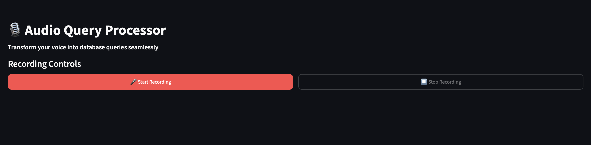
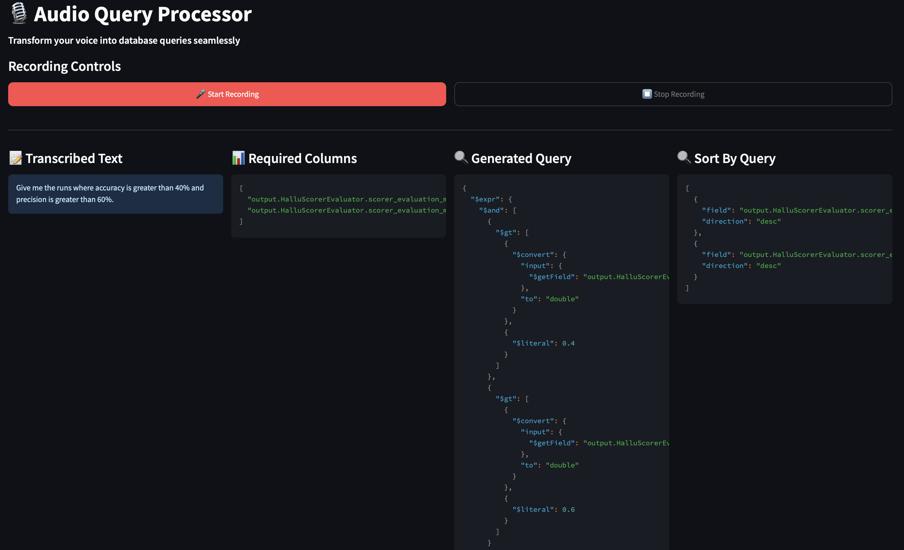
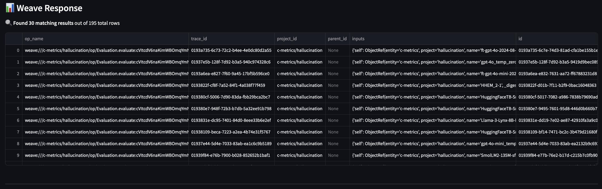
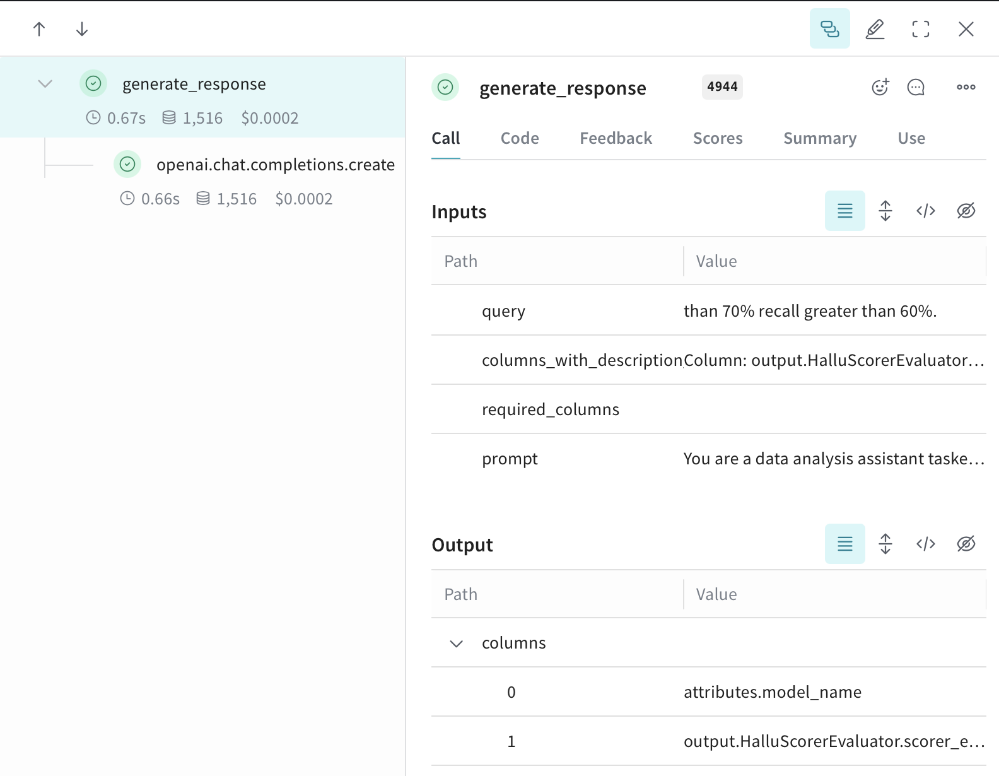

# Audio Query Processor

A Streamlit application that transforms voice input into database queries for data analysis. This tool allows users to speak their query, which is then processed, transcribed, and converted into a database query to retrieve relevant information.

## Features

- 🎙️ Voice recording and transcription
- 🔍 Natural language to database query conversion
- 📊 Data visualization of query results
- 🧠 Intelligent column selection based on query intent
- 📋 Sorting and filtering capabilities
- 📈 LLM performance monitoring (latency, tokens, prompts) via Weights & Biases
- 🔬 Comprehensive evaluation metrics logged on Weights & Biases

## Installation

1. Clone the repository:```bash
git clone https://github.com/prateekchhikara/audio_query_processor```

```
cd audio_query_processor
```

2. Install the required dependencies:
```bash
pip install -r requirements.txt
```

3. Set up your environment variables:
   - Create a `.env` file in the root directory
   - Add your OpenAI API key: `OPENAI_API_KEY=your_api_key_here`
   - Add your Weights & Biases API key: `WANDB_API_KEY=your_wandb_api_key_here` (optional for logging)

## Usage

1. **Start the Streamlit application**:
   ```bash
   streamlit run main.py
   ```

2. **Speak your query using the recording controls**:
   

   <details>
   <summary>Sample queries you can try (click to expand)</summary>
   
   - models which has latency less than 100ms
   - models which has accuracy greater than 90%
   - models which has F1 score greater than 0.95
   - models with precision above 0.85 and recall greater than 0.8
   - models trained for more than 3 epochs with learning rate less than 0.001
   - models where the model name contains 'gpt'
   - models with generation time less than 200ms and accuracy above 0.85
   - models with total tokens mean less than 500
   - models where the warmup ratio is greater than 0.1
   - models with true hallucination fraction less than 0.3
   </details>

3. **Review your transcribed text and the generated database query**:
   

4. **Explore the retrieved data results and visualizations**:
   

5. **Track performance metrics and evaluation results in Weights & Biases**:
   

## Testing the Pipeline

You can test the query processing pipeline using the evaluation script:

```bash
python evals.py
```

This script evaluates the system on 10 predefined test queries with ground truth filters. The evaluation results are logged to Weights & Biases, allowing you to track the accuracy of the query generation process and identify potential areas for improvement.

## Project Structure

```
audio_query_processor/
├── main.py              # Main Streamlit application
├── utils.py             # Utility functions for audio processing and API calls
├── prompts.py           # Prompt templates for language model interactions
├── evals.py             # Evaluation scripts for query accuracy
├── config.py            # Configuration settings for the application
├── columns.json         # Database column descriptions
├── requirements.txt     # Project dependencies
└── README.md            # Project documentation
```

## Configuration

The `config.py` file contains important configuration settings for the application:

- `MODEL_NAME`: The name of the OpenAI model used for processing queries (default: "gpt-4o")
- `DATASET_DB`: The source of the database deployed on Weights & Biases
- `PROJECT_NAME`: The name of the project in Weights & Biases (can be modified by the user)

You can modify these settings to customize the application according to your needs.

## Technologies Used

- Streamlit: Web application framework
- Whisper: Audio transcription model
- OpenAI GPT: Natural language processing
- Weave: Database interaction and query execution
- SoundDevice: Audio recording and processing
- Weights & Biases: LLM performance monitoring and evaluation logging

## Monitoring and Evaluation

The application logs key LLM performance metrics to Weights & Biases:
- Latency measurements for API calls
- Token usage statistics
- Prompt templates and variations
- Evaluation metrics for query accuracy and relevance

Access the Weights & Biases dashboard to analyze performance trends, compare different prompt strategies, and identify optimization opportunities.

## License

This project is licensed under the MIT License - see the LICENSE file for details.

